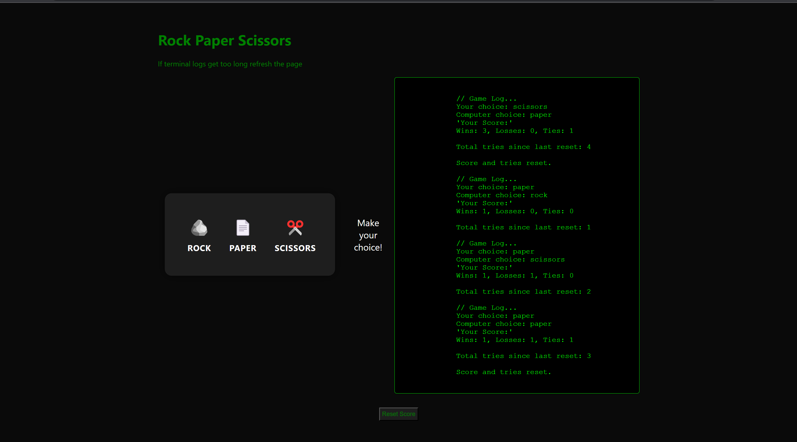

# Rock Paper Scissors Game

This is a simple Rock Paper Scissors game implemented using HTML, CSS, and JavaScript. The game has a terminal-like interface that logs user activity and results. It also includes a reset button to clear the score and tries.

## Table of Contents

- [Preview](#preview)
- [Features](#features)
- [Getting Started](#getting-started)
- [How to Play](#how-to-play)
- [Resetting the Score](#resetting-the-score)
- [Customization](#customization)
- [License](#license)

## Preview



## Features

- User-friendly interface with emoji representations of rock, paper, and scissors.
- Animated result display and terminal-like log for each game.
- Persistent score and tries storage using `localStorage`.
- Reset button to clear the score and tries.

## Getting Started

To run the game locally, simply clone the repository:

```bash
git clone https://github.com/David-Okello/Rock-Paper-Scissors-JS.git
```

Open the game.html file in your web browser to play the game.

## How to Play
 1. Click on one of the choices: Rock, Paper, or Scissors.
 2. The computer will randomly choose its move.
 3. The result will be displayed along with a terminal-like log.
 4. Keep playing to see your score accumulate.

## Reseting the Score
To reset the score and tries, click the "Reset Score" button. This will clear the local storage and set the score and tries back to zero.

## Customization
You can customize the game by modifying the HTML, CSS, and JavaScript files. For example:

  1. Change the colors and styles in the CSS file (game.css).
  2. Modify the emoji or text representations in the HTML file (game.html).
  3. Adjust the logic of the game in the JavaScript file (game.js).

Feel free to experiment and make the game your own!